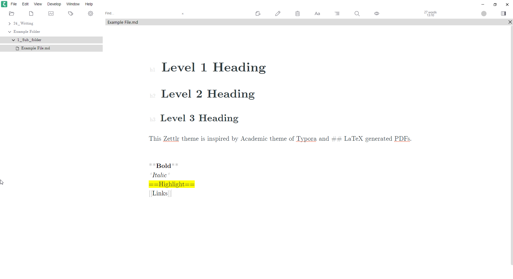

# Zettlr-LaTeX-Academic

This Zettlr custom theme is inspired by Academic theme of Typora and Latex PDF output. 

## Steps to install
1. Install font 'CMU Serif' if not available
2. Copy the contents from the custom.css
3. Paste to Zettlr menu File -- Preferences -- Custom CSS and save 

## Instructions to install 'CMU Serif' font
- Download font file from https://sourceforge.net/projects/cm-unicode/ or other sources

## Acknowledgement
Part of the code here is reused from https://github.com/jegornagel/zettlr-sublime

